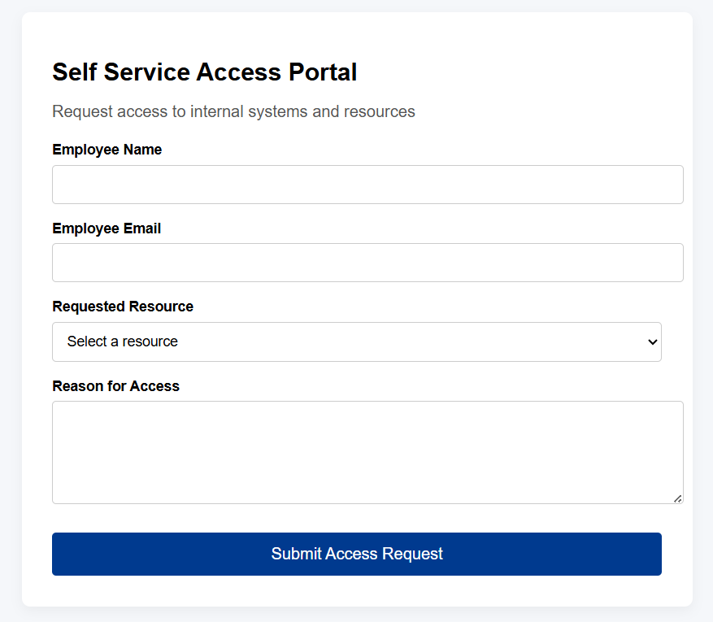
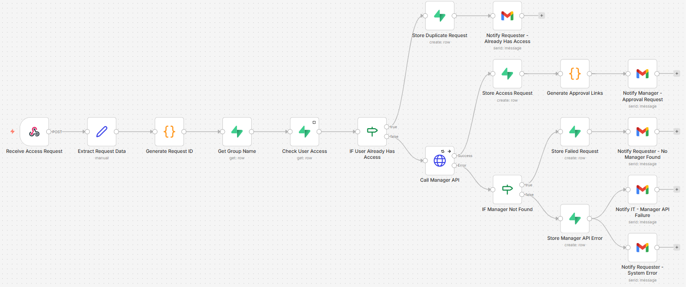
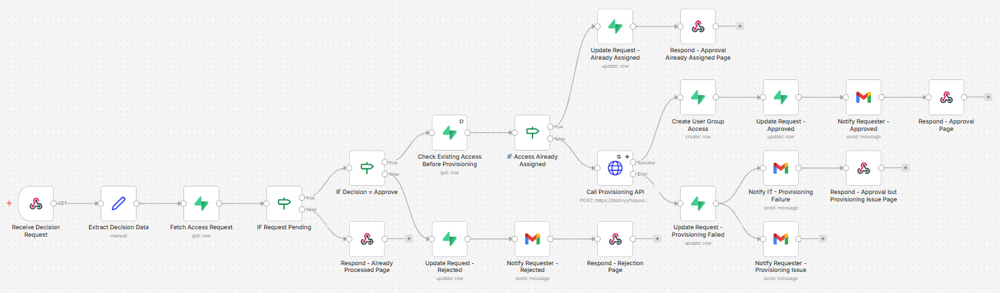

# Automated Access Request & Provisioning Workflow

An end-to-end access management automation workflow that lets employees request internal tool access, routes approvals to managers via email, and automatically provisions access through API integrations once approved.

Built to demonstrate **workflow orchestration**, **API integration**, **event-driven automation**, and enterprise-style access provisioning logic.

---

## What it does

```
Employee submits request → Manager approves via email → Access provisioned automatically
```

The system is powered by two event-driven workflows:

- **Submission Workflow** — triggered when an employee submits the web form; handles manager resolution and sends the approval email
- **Decision Workflow** — triggered when the manager clicks Approve or Reject in the email; handles provisioning, notifications, and audit logging

Together they cover the full lifecycle:

1. Employee fills out a lightweight web form to request a resource
2. Submission Workflow fires → resolves their manager and sends a structured approval email
3. Manager approves or rejects with a single click
4. Decision Workflow fires → provisions access automatically on approval, or notifies the requester on rejection
5. Every action is tracked with full audit trail and failure handling

---

## Web Form



---

## Submission Workflow

Triggered by a **webhook on form submission**.



---

## Decision Workflow

Triggered by a **webhook on manager email click** (Approve or Reject).



---

## Why it exists

In most organizations, access provisioning is still manual — ticket-based, IT-dependent, and poorly tracked. This workflow replaces that with a fully automated, event-driven process.

| Before | After |
|---|---|
| Manual IT ticket | Self-service web form |
| Hours or days to provision | Near real-time |
| No audit trail | Full lifecycle tracking |
| Error-prone email chains | Automated approval flow |

---

## Tech Stack

| Layer | Technology |
|---|---|
| Workflow Orchestration | n8n |
| Database | Supabase (PostgreSQL) |
| Backend / APIs | n8n workflows + Supabase Edge Functions |
| Frontend | HTML form |
| Notifications | Gmail API |
| Provisioning | API-based group management |

---

## Architecture

```
Frontend (Employee Request Form)
        │
        │  form submission
        ▼
Submission Workflow (n8n)
        │
        ├── Manager Lookup API
        │
        └── Approval Email (Gmail API)
                 │
                 │  manager clicks Approve / Reject
                 ▼
        Decision Workflow (n8n)
                 │
                 ├── Approve → Provisioning API → Assign group → Confirm email
                 └── Reject  → Notify requester
                 │
                 ▼
        Supabase Database (State + Audit Layer)
                 │
                 ├── access_requests
                 ├── resource_group_map
                 └── user_group_access
```

---

## Workflow Breakdown

### 1. Request Submission

Employee submits a form with the resource they need and a business justification.

Example resources: `Analytics Software License`, `Marketing SharePoint Access`

> **Submission Workflow** is triggered here via webhook on form submit.

### 2. Manager Resolution

```
GET /api/manager/{employee-email}
```

### 3. Approval Email

Manager receives a structured email with request details, justification, and one-click Approve / Reject links.

> **Decision Workflow** is triggered here via webhook when the manager clicks either link.

### 4. Decision Handling

**On Approve:**
- Update request status in database
- Trigger provisioning API
- Add user to the mapped permission group
- Send confirmation email to requester

**On Reject:**
- Update request status
- Notify requester

### 5. Failure Handling

If provisioning fails, the Decision Workflow flags the request, notifies IT, alerts the user of the delay, and logs the error for audit.

---

## Database Schema

**`access_requests`** — Full lifecycle tracking per request (ID, user, resource, justification, approval status, provisioning status, error logs)

**`resource_group_map`** — Maps business-facing resource names to permission groups

| Resource | Group |
|---|---|
| Marketing SharePoint | `marketing-sharepoint-group` |
| Analytics License | `analytics-license-users` |

**`user_group_access`** — Prevents duplicate provisioning, tracks active access

---

## Edge Cases Handled

- Duplicate access requests
- User already has the requested access
- Manager lookup failure
- Provisioning API failure with retry prevention
- Partial workflow failures with IT escalation paths

---

## What this demonstrates

- Event-driven workflow architecture (two discrete workflows, each triggered by a distinct external event)
- Workflow automation and orchestration design
- API integration across distributed services
- Approval-based enterprise workflows
- Robust error handling and edge case coverage
- Database design for auditability
- Building production-style internal tooling
